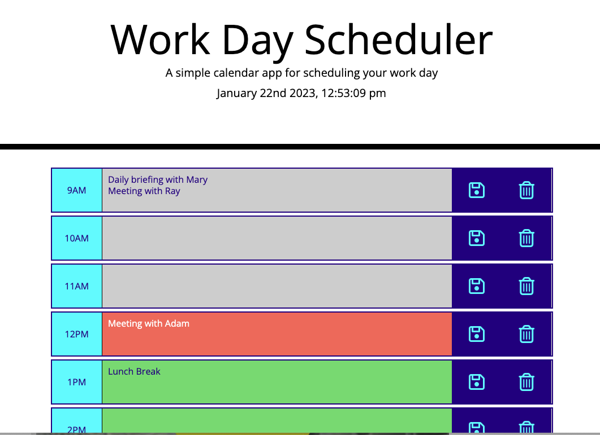

# Work Day Scehduler

## Description
This repository contains the source files for a simple calendar application. The app enables a user to save events for each hour of their work day. I began with a starter code and modified it to achieve the desired functionality. The app runs in a web browser, featuring dynamically updated HTML and CSS powered by jQuery and Moment.js library for date and time functionality.

## Technologies Used
* HTML
* CSS
* JavaScript
* jQuery
* Moment.js
* Bootstrap
* Font Awesome

## Instructions
* Open the application and click on the text area to add your schedule for each hour of the work day. 
* Click the save button corresponding to a particular time to save the schedule to your local storage, so that the data will remain even after a page refresh.
* Click the trash button corresponding to a particular time to delete the item from your schedule (Note: this does NOT delete the item from local storage if it has been saved).
* To delete ALL saved entries in the local storage, double-click any trash button.

## Live Application
https://ladykays.github.io/work-day-scheduler

## Screenshots

## Credits
* <a href="https://stackoverflow.com/users/3951400/e-sundin">E. Sundin</a>  
  https://stackoverflow.com/questions/34625764/moment-js-dynamically-update-time-in-seconds

* https://blog.logrocket.com/localstorage-javascript-complete-guide/add description

* https://momentjs.com/docs/#/get-set/